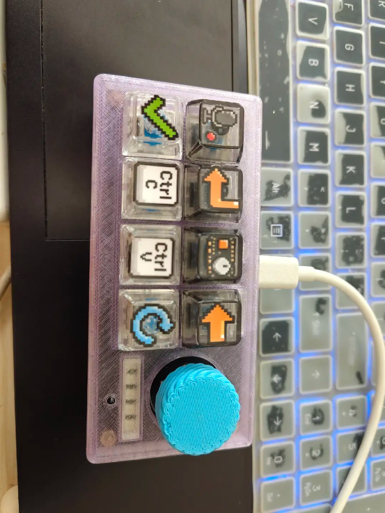
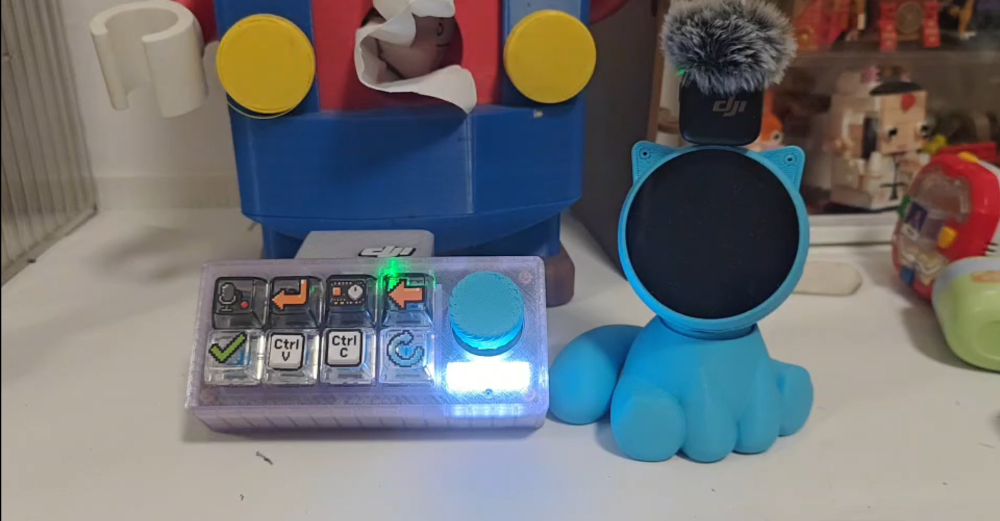

# xiaozhi-waytoagi

**WaytoAGI 社区 AI 键盘（EasyInput V2）的小智固件 —— 无屏版**

本项目基于开源项目 [xiaozhi-esp32（小智 AI）](https://github.com/78/xiaozhi-esp32) 二次开发，**专门适配 WaytoAGI 社区的 AI 键盘**（硬件名 EasyInput V2 / PCB 丝印 AI Keyboard V2.1，固件板型别名 `easyinput-v2`）。

这块键盘**没有屏幕**，所以全部交互都靠 **语音 + 5 颗 RGB 灯 + 按键 / 旋钮** 完成。本固件为它补齐了板级支持（音频、灯效、按键、编码器、电池），并修好了两个真机问题（见 [第七节](#七与原版-xiaozhi-esp32-的差异)）。

> ⚠️ 本项目是**第三方改编版**，不是小智官方仓库。上游版权与许可证见文末。

<p align="center">
  
</p>

<p align="center"><em>▲ WaytoAGI AI 键盘（EasyInput V2）—— 像素风键帽 + 半透明紫色外壳 + 青色旋钮</em></p>

---

## 一、能做什么（功能总览）

### 1. 语音对话（核心）
- **离线语音唤醒**：喊「**你好小智**」即可唤醒，无需联网、无需按键（基于乐鑫 [ESP-SR](https://github.com/espressif/esp-sr) WakeNet9）。
- 唤醒后可**自然语言对话**：闲聊、问天气、问知识等（接大模型，支持 WebSocket 与 MQTT+UDP 两种传输）。
- 支持**打断**：小智说话时再次唤醒或按键，可打断当前播报。

### 2. 音量控制
- **旋钮旋转**直接调音量：每转一格 ±5，范围 0–100，实时生效。
- **语音控制**：直接说「把音量调到 50」「声音大一点」，小智会调用设备工具帮你调。

### 3. 设备状态查询（语音）
- 可以**语音查询**设备的实时状态，例如：
  - 「现在电量多少？」
  - 「当前音量是几？」
  - 「网络连上了吗？」
- 由内置 MCP 工具 `self.get_device_status` 提供（返回音量、电池、网络等实时信息）。

### 4. 电池与充电
- 板载电池电压检测（VBAT/2 分压进 ADC）+ 充电状态检测。
- 电量可通过语音查询，也会在设备状态里上报。

### 5. 灯效反馈
- 5 颗 WS2812 RGB 灯随设备状态变化（待机 / 聆听 / 说话 / 配网 / 报错…），**一眼看状态**。详见 [第三节](#三灯效说明5-颗-ws2812)。

### 6. 配网
- 开机若未配网，按 **S1** 进入 Wi-Fi 配网模式（灯变蓝色慢闪），用手机完成配网。

> 说明：因为本板**无屏**，所以没有「屏幕亮度 / 主题」这类工具；也没有独立的语音灯控工具（灯效是**自动**跟随状态的）。

---

## 二、交互说明（按键与旋钮）

| 控件 | 位置 | 作用 |
| --- | --- | --- |
| **旋转编码器（旋钮）** | 板面 | **旋转 = 调节音量**（每格 ±5，范围 0–100） |
| **旋钮按压（S9）** | 编码器中心 | **开始 / 结束对话**（也可用于打断小智说话） |
| **S1 按键** | 主交互键 | ① 开机配网阶段：**进入 Wi-Fi 配网模式**；② 正常运行：**开始 / 结束对话**（同「打断」） |
| **S2–S8 按键** | 其余主键 | **预留**：当前固件未绑定动作，留作后续 MCP / App 扩展 |
| **绿色状态灯** | 板面 | 系统就绪指示（上电即亮） |

> ⚠️ **GPIO0 是 BOOT0 / 下载键**，属刷机入口，**不是**普通产品键，请勿当作功能键使用。

---

## 三、灯效说明（5 颗 WS2812）

灯带：5 颗串联 WS2812，接 **GPIO12**，GRB 格式。配色逻辑：**冷色 = 开机 / 配网，白 = 录音中，绿 = 输出中，红 = 异常**。

| 设备状态 | 颜色 | 动效 | 含义 |
| --- | --- | --- | --- |
| 开机（Starting） | 青色 | 扫光 | 上电启动 |
| 配网（WiFi Configuring） | 蓝色 | 慢闪（500ms） | 等待手机配网 |
| 待机在线（Idle） | 冷白 | 呼吸（1200ms） | 待机，随时可唤醒 |
| 连接服务器（Connecting） | 蓝色微光 | 常亮 | 正在连接 |
| **聆听（Listening）** | **白色** | **常亮** | **正在录音（你在说话）** |
| 说话 / 通知（Speaking） | 绿色 | 常亮 | 小智正在输出 |
| OTA 升级（Upgrading） | 绿色 | 快闪（120ms） | 正在升级 |
| 激活（Activating） | 绿色 | 慢闪（500ms） | 正在激活 |
| 致命错误（Fatal Error） | 红色 | 快闪（200ms） | 出现异常 |

**一句话记法**：**白色亮 = 在听你说；绿色亮 = 小智在说话；红色闪 = 出错了。**

<p align="center">
  
</p>

<p align="center"><em>▲ 工作状态实拍：EasyInput V2 与小智（5 颗 WS2812 已点亮）</em></p>

---

## 四、硬件规格

| 项目 | 参数 |
| --- | --- |
| 主控 | ESP32-S3R8（双核 LX7 @240MHz） |
| 内存 | 8MB Octal PSRAM |
| 存储 | 16MB Flash |
| 音频输入 | I2S 数字麦克风（BCLK=9 / WS=10 / DIN=11） |
| 音频输出 | MAX98357A 功放（BCLK=14 / LRCK=13 / DOUT=15） |
| 灯效 | 5× WS2812（GPIO12）+ 1× 绿色状态灯（GPIO42） |
| 交互 | 旋转编码器（A=17 / B=16，按压 S9=18）、S1 主键（GPIO2） |
| 电源 | 共享电源域使能 GPIO8（灯 + 麦克风 + 功放，先使能再初始化） |
| 电池 | 电量 ADC（GPIO4，VBAT/2）、分压使能 GPIO5、充电检测 GPIO39、外部供电检测 GPIO40 |
| 接口 | 原生 USB-C（下载 + 供电） |

---

## 五、编译与烧录

> 使用 **ESP-IDF v6.1**（Windows / PowerShell）。板型自动选择 `easyinput-v2`。

```powershell
# 1) 激活 IDF v6.1 环境（PowerShell）
#    注意：必须「点源」执行；系统 python 版本要与 IDF 的 venv 匹配
. <IDF_PATH>\export.ps1

# 2) 编译（build.py 会依据 board 名自动选中 easyinput-v2）
python scripts\build.py easyinput-v2

# 3) 烧录（把 COMx 换成你的串口）
idf.py -p COMx flash
```

**三个 Windows 环境坑：**

1. **系统 python ≠ IDF venv 版本** → 会报 `venv not found`。解决办法：先把 IDF venv 的 `Scripts` 目录加进 PATH，让 `python` 指向正确版本。
2. **`export.ps1` 必须用 `.`（点源）执行**，用 `& ` 或管道会丢失环境变量 → 报 `ESP-IDF version was not detected`。
3. **建议从 PATH 移除 `ccache`**：某些 Windows 环境下 `python → idf.py → ninja → ccache` 的深层进程派发拉不起 ccache，报 `CreateProcess failed: 系统找不到指定的文件`，表现为**大量文件“编译失败”**。ccache 仅做加速、并非必需，去掉即可正常编译。

---

## 六、已知问题

- **开机偶发掉电重启**：当 USB 口 / 线供电不足时，开机瞬间（WS2812 + 功放 + Wi-Fi 发射的电流冲击）可能触发 `Brownout detector` 复位。换供电更强的 USB 口 / 线或带独立供电的 Hub 即可。**与固件逻辑无关。**

---

## 七、与原版 xiaozhi-esp32 的差异

- 新增板型 **`easyinput-v2`**（**无屏**）。
- **麦克风使用 I2S 右声道**（`I2S_STD_SLOT_RIGHT`）：本键盘的 I2S 麦克风数据落在 WS 高电平（右声道），若用默认左声道会采到静音 —— 表现为「喊你好小智没反应、说话没有回应」。
- **无屏板提前 `lv_init()`**：小智的资源配置模块会**先构造 LVGL 字体、后判断显示设备**，无屏板若不初始化 LVGL 会在启动时崩溃（`LoadProhibited`）。本固件在板子初始化最前调用 `lv_init()` 规避。
- 自定义 5 颗 WS2812 的**状态灯效**（`EasyInputV2Strip`）。
- 板级支持：旋转编码器调音量、S1 按键、电池监测。

---

## 八、许可证与致谢

- 本项目基于 **[xiaozhi-esp32](https://github.com/78/xiaozhi-esp32)**（作者：Shenzhen Xinzhi Future Technology Co., Ltd.，**MIT License**）二次开发，保留上游许可证。
- 硬件事实（引脚、电源域、器件型号）依据 **EasyInput V2 硬件合同**（`easyinput-board-cy`），而非通用 ESP32 教程。
- 适配目标：**WaytoAGI 社区的 AI 键盘**。
